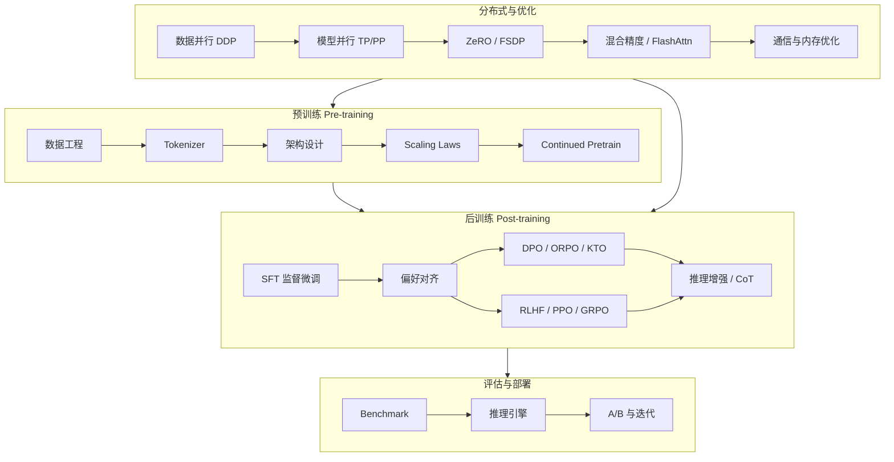

# 00 大模型训练学习路线

本文档提供 **预训练 → 后训练 → 分布式优化 → 工程部署** 的系统学习路径，与现有 Coding Agent SFT 实操文档互补。

## 知识全景图

## 学习阶段

### 阶段 0：基础预备（1~2 周）

**主文档**：[00-基础预备.md](./00-基础预备.md)

| 主题 | 要掌握什么 | 文档章节 | 延伸阅读 |
|------|-----------|----------|----------|
| Transformer | Self-Attention、RoPE、RMSNorm、SwiGLU | [§1](./00-基础预备.md#1-transformer-架构) | [The Annotated Transformer](https://nlp.seas.harvard.edu/annotated-transformer/) |
| PyTorch 分布式 | `DistributedDataParallel`、进程组、AllReduce | [§2](./00-基础预备.md#2-pytorch-分布式) | [PyTorch Distributed](https://pytorch.org/tutorials/beginner/dist_overview.html) |
| HuggingFace 生态 | `transformers`、`datasets`、`Trainer` | [§3](./00-基础预备.md#3-huggingface-生态) | [HF Course](https://huggingface.co/learn/nlp-course) |
| 训练基础概念 | Loss、LR Schedule、Warmup、Gradient Clipping | [§4](./00-基础预备.md#4-训练基础概念) | [08-核心概念与论文.md](./08-核心概念与论文.md) |

**自测**：[§5 自测与实践](./00-基础预备.md#5-自测与实践) — 能手写单层 Attention 前向；能解释 `loss = CrossEntropy(logits[:, :-1], labels[:, 1:])` 的含义。

---

### 阶段 1：预训练（2~4 周）

**目标**：理解「基座模型从哪来」，而不是只会调 SFT。

| 顺序 | 文档 | 核心问题 |
|------|------|----------|
| 1 | [05-预训练基础.md](./05-预训练基础.md) | 数据怎么洗？Tokenizer 怎么训？CLM 目标是什么？ |
| 2 | [07-分布式训练与优化.md](./07-分布式训练与优化.md) §1~3 | 为什么 70B 需要多卡？ZeRO 省了什么显存？ |
| 3 | [08-核心概念与论文.md](./08-核心概念与论文.md) §Scaling Laws | Chinchilla 最优 token 数怎么算？ |

**实践建议**（由浅入深）：

1. 在小语料（如 WikiText-2）上跑通 GPT-2 级别 CLM 预训练
2. 用 LLaMA-Factory / nanoGPT 观察 loss 曲线和 perplexity
3. 尝试 Continued Pretrain：在领域语料上继续预训练 7B 基座

**自测**：能解释 Pretrain vs CPT vs SFT 的数据格式和 loss mask 差异。

---

### 阶段 2：后训练（2~3 周）

**目标**：掌握 SFT → 对齐 → 推理增强的完整链路。

| 顺序 | 文档 | 核心问题 |
|------|------|----------|
| 1 | [01-数据准备.md](./01-数据准备.md) | Agent 轨迹怎么转 ShareGPT？ |
| 2 | [02-训练配置.md](./02-训练配置.md) | LoRA vs Full SFT 怎么选？ |
| 3 | [06-后训练详解.md](./06-后训练详解.md) | DPO 和 RLHF 区别？GRPO 为什么适合推理？ |
| 4 | [03-评估与部署.md](./03-评估与部署.md) | 怎么避免 SFT 后通用能力退化？ |

**实践建议**：

1. 按现有文档完成一次 Coding Agent LoRA SFT
2. 构造 100 条 chosen/rejected 对，跑通 DPO
3. 对比 SFT-only vs SFT+DPO 在 benchmark 上的差异

**自测**：能画出 Pretrain → SFT → DPO/RLHF 的数据流和 loss 函数。

---

### 阶段 3：分布式与性能优化（3~4 周）

**目标**：能在多卡集群上稳定训练 7B~70B 模型。

| 顺序 | 文档 | 核心问题 |
|------|------|----------|
| 1 | [07-分布式训练与优化.md](./07-分布式训练与优化.md) | TP/PP/DP 怎么组合？ |
| 2 | [02-训练配置.md](./02-训练配置.md) §DeepSpeed | ZeRO-3 配置怎么写？ |
| 3 | [07-分布式训练与优化.md](./07-分布式训练与优化.md) §性能调优 | MFU 怎么算？瓶颈在 compute 还是通信？ |

**实践建议**：

1. 2 卡 DDP LoRA → 4 卡 ZeRO-2 Full SFT → 8 卡 ZeRO-3
2. 开启/关闭 Flash Attention、Gradient Checkpointing，记录 tokens/sec
3. 用 `nvidia-smi dmon` 和 PyTorch Profiler 定位瓶颈

**自测**：给定 8×A100 80G，能估算 32B Full SFT 需要的 batch size 和是否 OOM。

---

### 阶段 4：评估与生产迭代（持续）

| 文档 | 场景 |
|------|------|
| [03-评估与部署.md](./03-评估与部署.md) | Benchmark、vLLM 部署、A/B |
| [04-工具脚本.md](./04-工具脚本.md) | Agent 轨迹采集与 Replay |
| [06-后训练详解.md](./06-后训练详解.md) §迭代 | SFT → DPO → GRPO 闭环 |

## 文档索引（完整）

| 文档 | 类型 | 适合阶段 |
|------|------|----------|
| [00-学习路线.md](./00-学习路线.md) | 路线图 | 全程 |
| [00-基础预备.md](./00-基础预备.md) | 系统教程 | **阶段 0** |
| [05-预训练基础.md](./05-预训练基础.md) | 理论 + 实践 | 阶段 1 |
| [06-后训练详解.md](./06-后训练详解.md) | 理论 + 实践 | 阶段 2 |
| [07-分布式训练与优化.md](./07-分布式训练与优化.md) | 理论 + 实践 | 阶段 1/3 |
| [08-核心概念与论文.md](./08-核心概念与论文.md) | 速查 + 论文 | 全程 |
| [01-数据准备.md](./01-数据准备.md) | SFT 实操 | 阶段 2 |
| [02-训练配置.md](./02-训练配置.md) | SFT 实操 | 阶段 2/3 |
| [03-评估与部署.md](./03-评估与部署.md) | 评估部署 | 阶段 2/4 |
| [04-工具脚本.md](./04-工具脚本.md) | 工具链 | 阶段 2/4 |

## 常见误区

| 误区 | 正确理解 |
|------|----------|
| 「SFT 就是训练模型」 | SFT 只是后训练第一步；基座能力来自预训练 |
| 「数据越多越好」 | Pretrain 看 token 质量与配比；SFT 看轨迹质量 |
| 「多卡 = 线性加速」 | 通信开销、Pipeline Bubble 会显著影响效率 |
| 「对齐 = RLHF」 | DPO/ORPO/KTO 等 offline 方法更轻量，工业界广泛使用 |
| 「训完最后一个 checkpoint 最好」 | 后期常过拟合，需在 val/benchmark 上选最优 |

## 推荐动手项目

按难度递增：

1. **Mini-CLM**：在 100M 参数模型 + 小语料上跑通预训练全流程
2. **Domain CPT**：对 Qwen-7B 做代码领域 continued pretrain
3. **Agent SFT**：按 [01~02](./01-数据准备.md) 完成 Coding Agent 微调
4. **Preference Align**：SFT 模型 + 200 条 DPO 偏好对
5. **Multi-GPU Scale**：8 卡 ZeRO-3 训练 32B Full SFT

## 学习时间参考

| 背景 | 阶段 0~2 | 阶段 3 | 合计 |
|------|----------|--------|------|
| 有 ML 基础，无 LLM 训练经验 | 4~6 周 | 3~4 周 | 2~3 月 |
| 有 NLP/训练经验 | 2~3 周 | 2~3 周 | 1~2 月 |
| 已做过 SFT，补预训练/分布式 | 1~2 周 | 2~3 周 | 1 月 |
