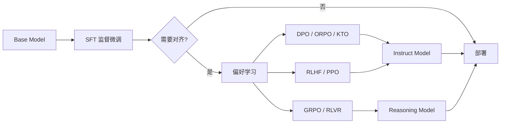

# 06 后训练详解

后训练（Post-training）在预训练基座之上，通过 **SFT → 偏好对齐 → 推理增强** 等阶段，把「会续写文本的模型」变成「能遵循指令、安全有用、具备特定能力的模型」。

## 1. 后训练全景



| 阶段 | 输入 | 输出 | 典型数据量 |
|------|------|------|-----------|
| SFT | 指令-回复对 / 多轮轨迹 | 能对话、能调工具 | 1K~100K 条 |
| DPO/RLHF | 偏好对 (chosen/rejected) | 更符合人类偏好 | 1K~50K 对 |
| GRPO/RLVR | 可验证 reward（数学/代码） | 推理能力增强 | 10K~1M 样本 |
| Distillation | 强模型输出 | 小模型能力迁移 | 视规模 |

## 2. SFT（Supervised Fine-Tuning）

SFT 是后训练的第一步，也是 Coding Agent 场景的核心。现有实操文档：

- 数据格式：[01-数据准备.md](./01-数据准备.md)
- 训练配置：[02-训练配置.md](./02-训练配置.md)

### 2.1 SFT 在学什么

```
Pretrain:  P(任意续写 | 前文)         → 文本补全
SFT:       P(理想回复 | 指令+上下文)  → 任务执行
```

Loss 通常 **只计算 assistant 部分**（user/system/tool 部分 mask 为 -100）：

```python
# 伪代码：只对 assistant token 计算 loss
for token, role in zip(tokens, roles):
    if role != "assistant":
        labels[token] = -100  # ignore
```

### 2.2 SFT 数据类型

| 类型 | 格式 | 用途 |
|------|------|------|
| 单轮指令 | instruction + response | 通用对话 |
| 多轮对话 | messages[] | Chat 能力 |
| Tool Use 轨迹 | messages + tool_calls | Agent / Coding |
| 多模态 | messages + images | VLM |

### 2.3 Full SFT vs LoRA

| | LoRA | Full SFT |
|---|------|----------|
| 可训练参数 | 0.1~2% | 100% |
| 显存 | 低 | 高 |
| 能力上限 | 受 rank 限制 | 更高 |
| 适用 | 快速实验、小数据 | 大数据、领域深度定制 |
| 多 adapter | 可切换 | 需完整 checkpoint |

**经验法则**：
- 数据 < 5K、快速验证 → LoRA rank 64
- 数据 > 10K、追求上限 → Full SFT
- 需保留基座通用能力 → LoRA + 混合通用数据

### 2.4 SFT 常见问题

| 问题 | 原因 | 解决 |
|------|------|------|
| 灾难性遗忘 | 只训领域数据 | 混合 10~20% 通用数据 |
| 复读/啰嗦 | epoch 过多 | 减 epoch，加 early stopping |
| Tool calling 退化 | 数据缺 tool_calls | 保证 >60% 样本含工具调用 |
| 格式不稳定 | 数据格式不一致 | 统一 template |

## 3. 偏好对齐（Preference Alignment）

SFT 教模型「怎么做」，对齐教模型「哪个更好」。

### 3.1 RLHF 经典三阶段

```
1. SFT          → 初始 instruct 模型
2. Reward Model → 学习人类偏好打分
3. PPO          → 用 RM 奖励信号优化策略
```

#### Reward Model（RM）

输入：prompt + response → 输出：标量 reward

```json
{
  "prompt": "如何实现快速排序？",
  "chosen": "这是 Python 实现...（详细正确）",
  "rejected": "快速排序是一种算法...（空洞）"
}
```

RM 训练：Bradley-Terry loss，让 chosen 得分高于 rejected。

#### PPO（Proximal Policy Optimization）

```
循环:
  1. 当前策略 π 生成 response
  2. RM 打分 reward
  3. 加 KL 惩罚（不能偏离 SFT 太远）
  4. PPO 更新策略
```

**缺点**：训练不稳定、需维护 4 个模型（policy, ref, reward, critic）、工程复杂。

### 3.2 DPO（Direct Preference Optimization）

**核心思想**：把 RLHF 的 reward 建模隐式吸收进 loss，无需单独 RM 和 PPO。

```
L_DPO = -log σ(β · (log π(chosen|x)/π_ref(chosen|x)
                  - log π(rejected|x)/π_ref(rejected|x)))
```

| | RLHF (PPO) | DPO |
|---|-----------|-----|
| 需 Reward Model | 是 | 否 |
| 在线采样 | 是 | 否（offline） |
| 训练稳定性 | 差 | 好 |
| 显存 | 4 模型 | 2 模型（policy + ref） |
| 工业采用 | 早期主流 | 当前主流 |

#### DPO 数据格式

```json
{
  "conversations": [
    {"from": "human", "value": "创建一个待办清单应用"},
    {"from": "gpt", "value": "...", "tool_calls": [...]}
  ],
  "chosen": {"from": "gpt", "value": "正确的完整轨迹"},
  "rejected": {"from": "gpt", "value": "跳步/错误工具调用/未完成"}
}
```

#### DPO 训练命令

```bash
llamafactory-cli train \
  --stage dpo \
  --model_name_or_path ./output/sft-v1/merged \
  --ref_model ./output/sft-v1/merged \
  --dataset coding_agent_dpo \
  --pref_beta 0.1 \
  --finetuning_type lora \
  --learning_rate 5e-7 \
  --num_train_epochs 1
```

**关键超参**：
- `pref_beta`：0.01~0.5，越大对齐越强但可能牺牲多样性
- `learning_rate`：比 SFT 低 1~2 个数量级（5e-7 ~ 1e-6）

### 3.3 其他对齐方法

| 方法 | 特点 | 适用 |
|------|------|------|
| **ORPO** | SFT + 偏好一体，无需 ref model | 资源有限 |
| **KTO** | 只需 good/bad 标签，不需成对 | 数据难凑对 |
| **SimPO** | 简化 DPO，去掉 ref model | 更轻量 |
| **IPO** | 改进 DPO 理论，更稳定 | DPO 不稳定时 |

```bash
# ORPO 示例（LLaMA-Factory）
llamafactory-cli train --stage orpo --pref_beta 0.1 ...
```

## 4. 推理增强：GRPO / RLVR

2024~2025 年主流：**用可验证 reward 做 RL**，提升数学、代码、推理能力。

### 4.1 GRPO（Group Relative Policy Optimization）

DeepSeek-R1 使用的核心方法，PPO 的简化变体：

```
对每个 prompt:
  1. 生成 G 个 response（一组）
  2. 分别计算 reward（如答案是否正确）
  3. 组内归一化 advantage = (r_i - mean(r)) / std(r)
  4. 策略梯度更新
```

**优势**：
- 不需要 Critic 模型
- 组内相对比较，降低 reward 绝对值依赖
- 适合 outcome reward（对/错）

### 4.2 RLVR（Reinforcement Learning with Verifiable Rewards）

```
Reward 来源:
  数学  → 答案数值匹配
  代码  → 单元测试通过
  工具  → 任务完成 + lint pass
  格式  → JSON schema 校验
```

Coding Agent 场景的 RLVR reward 设计：

```python
def compute_reward(trajectory):
    score = 0.0
    if trajectory.task_completed:    score += 0.4
    if trajectory.lint_passed:       score += 0.2
    if trajectory.build_success:    score += 0.2
    if trajectory.tool_acc > 0.9:   score += 0.2
    return score
```

### 4.3 常用 RL 训练框架

| 框架 | 特点 |
|------|------|
| [OpenRLHF](https://github.com/OpenRLHF/OpenRLHF) | 完整 RLHF/PPO/DPO 管线 |
| [verl (Volcano Engine RL)](https://github.com/volcengine/verl) | 高效 GRPO，DeepSeek 生态 |
| [TRL](https://github.com/huggingface/trl) | HF 官方，DPO/PPO/GRPO |
| LLaMA-Factory | DPO/ORPO，轻量 |

## 5. 知识蒸馏（Distillation）

把强模型（Teacher）能力迁移到弱模型（Student）：

```
Teacher (GPT-4 / DeepSeek-R1)
    ↓  生成 response / CoT
Student (7B / 14B)
    ↓  SFT on teacher outputs
Distilled Model
```

### 5.1 蒸馏类型

| 类型 | 方法 |
|------|------|
| Response Distillation | 用 teacher 输出作 SFT 标签 |
| CoT Distillation | 蒸馏推理链（...） |
| On-Policy Distillation | Student 采样，Teacher 打分指导 |

### 5.2 实践建议

- 蒸馏数据质量 > 数量：筛选 teacher 高置信输出
- CoT 蒸馏需足够 context length
- 蒸馏后常需少量 DPO 修正偏好

## 6. 后训练数据策略

### 6.1 数据混合比例（参考）

```
SFT 阶段:
  目标任务数据:  70~80%
  通用对话数据:  10~20%
  安全/拒答数据:   5~10%

DPO 阶段:
  任务相关偏好对: 80%
  通用偏好对:     20%
```

### 6.2 迭代闭环

```
v1 SFT → Benchmark → 发现弱点（如 tool selection）
    ↓
采集针对性数据（100~500 条）
    ↓
v2 SFT（混合旧数据 + 新数据，避免遗忘）
    ↓
DPO（200~1000 偏好对）
    ↓
Benchmark → 上线 A/B
```

详见 [03-评估与部署.md](./03-评估与部署.md) §6。

## 7. 各阶段 Loss 对比

| 阶段 | Loss 函数 | 需要 Reference Model |
|------|-----------|---------------------|
| Pretrain | CE（全 token） | 否 |
| SFT | CE（assistant token） | 否 |
| DPO | Preference loss | 是（冻结） |
| PPO | Policy gradient + KL | 是 |
| GRPO | Group-normalized PG | 可选 |

## 8. 后训练超参速查

| 阶段 | LR | Epoch | Batch (effective) | 备注 |
|------|-----|-------|-------------------|------|
| SFT LoRA | 1e-5 | 2~5 | 8~32 | 见 [02-训练配置.md](./02-训练配置.md) |
| SFT Full | 5e-6 | 1~3 | 32~128 | |
| DPO | 5e-7~1e-6 | 1~2 | 8~32 | β=0.1 起步 |
| GRPO | 1e-6~5e-6 | 1 | 按 prompt 组 | G=8~64 |

## 9. 选型决策树

```
需要快速上线 Agent？
  └─ SFT（LoRA）→ 评估 → 够用则部署

SFT 后回复质量不稳定 / 有两种风格？
  └─ DPO（200+ 偏好对）

需要数学/代码推理能力提升？
  └─ GRPO + 可验证 reward

资源有限，想 SFT+对齐一步完成？
  └─ ORPO

有充足资源，追求极致对齐？
  └─ SFT → RM → PPO（经典 RLHF）
```

## 10. 检查清单

- [ ] SFT 数据 system prompt 与线上一致
- [ ] SFT 后做通用能力回归测试
- [ ] DPO 的 chosen/rejected 差异明确（非细微差别）
- [ ] DPO 学习率比 SFT 低至少 10x
- [ ] RL 训练监控 KL divergence，防止模式崩溃
- [ ] 每个阶段保留 checkpoint，支持回滚

## 11. 延伸阅读

- **InstructGPT** (Ouyang et al., 2022) — RLHF 奠基
- **DPO** (Rafailov et al., 2023) — 直接偏好优化
- **DeepSeek-R1** (2025) — GRPO + RLVR 推理模型
- **ORPO** (Hong et al., 2024) — 一体式对齐

完整论文列表见 [08-核心概念与论文.md](./08-核心概念与论文.md)。
