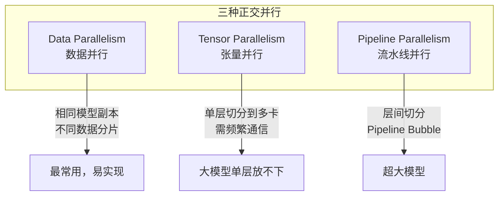

# 07 分布式训练与优化

训练 7B 以上模型或多卡并行 SFT，必须理解分布式策略。本章覆盖 **并行范式、显存优化、通信优化、性能调优**。

## 1. 为什么需要分布式

### 1.1 显存估算

训练一个 transformer 模型的显存 ≈ 模型参数 + 梯度 + 优化器状态 + 激活值。

| 组件 | FP32 | BF16/FP16 | 说明 |
|------|------|-----------|------|
| 模型参数 | 4 bytes/param | 2 bytes/param | |
| 梯度 | 4 bytes/param | 2 bytes/param | |
| Adam 优化器 | 8 bytes/param | 8 bytes/param | m + v 各 4 bytes |
| **合计（静态）** | **16 bytes/param** | **12 bytes/param** | 不含激活 |

激活值（与 batch size、seq length 成正比）：

```
Activation ≈ batch × seq_len × hidden × layers × factor
```

**例：32B 模型 Full SFT（BF16）**

```
静态: 32B × 12 bytes ≈ 384 GB  → 单卡不可能
激活: batch=1, seq=32K → 额外 40~80 GB
→ 必须多卡 + 分片
```

### 1.2 并行维度概览



还有 **Sequence Parallelism (SP)** 和 **Context Parallelism (CP)** 用于超长序列。

## 2. 数据并行（Data Parallelism）

### 2.1 DDP（DistributedDataParallel）

最基础的并行方式：每张卡有 **完整模型副本**，处理不同数据 batch。

```
GPU0: model_copy → forward(batch_0) → backward → grad_0 ─┐
GPU1: model_copy → forward(batch_1) → backward → grad_1 ─┤ AllReduce → 同步更新
GPU2: model_copy → forward(batch_2) → backward → grad_2 ─┤
GPU3: model_copy → forward(batch_3) → backward → grad_3 ─┘
```

```python
import torch.distributed as dist
from torch.nn.parallel import DistributedDataParallel as DDP

dist.init_process_group("nccl")
model = Model().cuda()
model = DDP(model, device_ids=[local_rank])
# 正常 forward/backward，DDP 自动 AllReduce 梯度
```

**有效 batch size** = `per_device_batch × num_gpus × gradient_accumulation_steps`

### 2.2 何时 DDP 够用

- LoRA SFT（可训练参数少，优化器状态小）
- 7B 以下 Full SFT + Gradient Checkpointing + 多卡
- 显存瓶颈不在模型参数，而在激活值

## 3. ZeRO（Zero Redundancy Optimizer）

DeepSpeed 的核心贡献：消除数据并行中的 **冗余存储**。

### 3.1 三阶段对比

| Stage | 分片内容 | 每卡显存（相对） | 通信量 |
|-------|----------|-----------------|--------|
| ZeRO-1 | 优化器状态 | ~1/N | 低 |
| ZeRO-2 | + 梯度 | ~1/N | 中 |
| ZeRO-3 | + 模型参数 | ~1/N | 高 |

```
DDP:     每卡存 [params + grad + optimizer] × 100%
ZeRO-1:  每卡存 [params + grad] + optimizer/N
ZeRO-2:  每卡存 [params] + grad/N + optimizer/N
ZeRO-3:  每卡存 [params/N + grad/N + optimizer/N]
```

### 3.2 ZeRO-3 配置示例

`ds_z3_config.json`：

```json
{
  "bf16": {"enabled": true},
  "zero_optimization": {
    "stage": 3,
    "overlap_comm": true,
    "contiguous_gradients": true,
    "reduce_bucket_size": 5e8,
    "stage3_prefetch_bucket_size": 5e8,
    "stage3_param_persistence_threshold": 1e6,
    "offload_optimizer": {
      "device": "cpu",
      "pin_memory": true
    }
  },
  "gradient_accumulation_steps": "auto",
  "gradient_clipping": 1.0,
  "train_batch_size": "auto",
  "train_micro_batch_size_per_gpu": "auto"
}
```

LLaMA-Factory 使用：

```yaml
deepspeed: examples/deepspeed/ds_z3_config.json
```

ms-swift 使用：

```bash
swift sft --deepspeed zero3 ...
```

### 3.3 CPU/NVMe Offload

ZeRO-Infinity 可将 optimizer/params offload 到 CPU 甚至 NVMe：

```json
"offload_param": {"device": "cpu", "pin_memory": true},
"offload_optimizer": {"device": "cpu", "pin_memory": true}
```

**代价**：训练速度显著下降（PCIe 带宽瓶颈）。仅在 OOM 时使用。

## 4. FSDP（Fully Sharded Data Parallel）

PyTorch 原生方案，类似 ZeRO-3。

```python
from torch.distributed.fsdp import FullyShardedDataParallel as FSDP
from torch.distributed.fsdp import ShardingStrategy, MixedPrecision

model = FSDP(
    model,
    sharding_strategy=ShardingStrategy.FULL_SHARD,
    mixed_precision=MixedPrecision(
        param_dtype=torch.bfloat16,
        reduce_dtype=torch.bfloat16,
    ),
    device_id=torch.cuda.current_device(),
)
```

| | DeepSpeed ZeRO-3 | FSDP |
|---|-----------------|------|
| 生态 | HF Trainer 集成好 | PyTorch 原生 |
| 灵活性 | 配置丰富 | API 简洁 |
| 性能 | 成熟，offload 选项多 | torchtitan 默认 |
| 推荐 | LLaMA-Factory / ms-swift | torchtitan / 自定义 |

## 5. 模型并行

### 5.1 Tensor Parallelism（TP）

将 **单层** 的矩阵运算切分到多卡：

```
Attention:
  Q/K/V projection → 按 head 或 hidden dim 切分
  Output projection → 按 input dim 切分

FFN:
  gate/up projection → 按 intermediate dim 切分
  down projection → 按 input dim 切分
```

```
         ┌─ GPU0: Q[:, :h/2] ─┐
Input ───┤                    ├─→ Concat → Output
         └─ GPU1: Q[:, h/2:] ─┘
```

**特点**：
- 每层 forward/backward 都需要 AllReduce/AllGather
- TP degree 通常 2~8（通信频繁，不宜过大）
- vLLM 推理也使用 TP

### 5.2 Pipeline Parallelism（PP）

将 **不同层** 分配到不同 GPU：

```
GPU0: Layer 0-7   →  micro-batch 1, 2, 3, 4
GPU1: Layer 8-15  →  micro-batch 1, 2, 3, 4
GPU2: Layer 16-23 →  micro-batch 1, 2, 3, 4
GPU3: Layer 24-31 →  micro-batch 1, 2, 3, 4
```

**Pipeline Bubble** 问题：部分 GPU 空闲等待。

缓解方法：
- 增大 micro-batch 数量（GPipe）
- 1F1B schedule（Megatron 默认）
- Interleaved Pipeline（虚拟 stage）

### 5.3 3D 并行（Megatron-LM）

```
Total GPUs = TP × PP × DP

例：64 GPU 训练 405B
  TP=8, PP=4, DP=2  →  8×4×2=64
```

| 并行 | 解决什么 | 典型 degree |
|------|----------|-------------|
| TP | 单层放不下 | 2~8 |
| PP | 整个模型放不下 | 2~16 |
| DP | 加速训练 | 剩余 GPU |

## 6. 混合精度训练

### 6.1 精度选择

| 精度 | 范围 | 适用 |
|------|------|------|
| FP32 | 训练基准 | 梯度累积、loss scaling |
| BF16 | 与 FP32 同指数范围 | **训练首选**（A100/H100） |
| FP16 | 需 loss scaling | V100 等老卡 |
| FP8 | H100+ Tensor Core | 超大模型 pretrain |

```yaml
# LLaMA-Factory
bf16: true

# 或 FP16 + loss scaling
fp16: true
```

### 6.2 Flash Attention

将 Attention 的 O(N²) 显存降到 O(N)：

```bash
pip install flash-attn --no-build-isolation
```

```yaml
# LLaMA-Factory
flash_attn: fa2

# ms-swift
--attn_impl flash_attn
```

**效果**：seq_len=32K 时，激活显存可降 50%+，速度提升 2~3x。

### 6.3 Gradient Checkpointing

用 **计算换显存**：不存中间激活，backward 时重新计算。

```yaml
gradient_checkpointing: true
```

显存节省 ~30~50%，训练慢 ~20~30%。OOM 时的首选开关。

## 7. 通信优化

### 7.1 关键集合通信操作

| 操作 | 用途 | 并行类型 |
|------|------|----------|
| AllReduce | 同步梯度 | DP |
| AllGather | 收集分片参数 | ZeRO-3, TP |
| ReduceScatter | 分片梯度 | ZeRO |
| P2P Send/Recv | 层间传递 | PP |

### 7.2 通信优化技巧

```
1. Gradient Bucketing     — 合并小 tensor 的 AllReduce
2. Overlap Comm & Compute — 反向传播时重叠通信和计算
3. NCCL 拓扑优化           — 同节点内 NVLink，跨节点 InfiniBand
4. 增大 batch size         — 计算/通信比更高
```

### 7.3 多节点注意

```bash
# 启动多节点训练
torchrun \
  --nnodes=2 \
  --nproc_per_node=8 \
  --node_rank=0 \
  --master_addr=10.0.0.1 \
  --master_port=29500 \
  train.py
```

- 确保节点间 NCCL 连通（`NCCL_IB_DISABLE=0` 启用 IB）
- 跨节点带宽通常是瓶颈（100Gbps IB vs 900GB/s NVLink）

## 8. 显存优化策略汇总

按 **性价比** 排序：

| 优先级 | 策略 | 显存节省 | 速度影响 |
|--------|------|----------|----------|
| 1 | LoRA（代替 Full） | 极大 | 无 |
| 2 | BF16 | 50% vs FP32 | 加速 |
| 3 | Flash Attention | 30~50% | 加速 |
| 4 | Gradient Checkpointing | 30~50% | 慢 20~30% |
| 5 | 减小 batch / 增大 accum | 线性 | 无（有效 batch 不变） |
| 6 | 减小 seq length | 线性 | 无 |
| 7 | ZeRO-2/3 | 线性于卡数 | 小幅 |
| 8 | CPU Offload | 大 | 慢 2~5x |
| 9 | 量化训练 (QLoRA) | 极大 | 小幅 |

### QLoRA

4-bit 量化基座 + LoRA 训练：

```yaml
finetuning_type: lora
quantization_bit: 4
```

单卡 24G 可训 70B LoRA。

## 9. 性能度量

### 9.1 关键指标

| 指标 | 含义 | 目标 |
|------|------|------|
| tokens/sec | 吞吐量 | 越高越好 |
| MFU | Model FLOPs Utilization | >30% 良好，>50% 优秀 |
| GPU 利用率 | SM 活跃度 | >80% |
| 通信占比 | comm time / total | <20% |

### 9.2 MFU 计算

```
MFU = (实际 FLOPs/s) / (GPU 峰值 FLOPs/s)

实际 FLOPs/s ≈ 6 × params × tokens/sec  （forward + backward ≈ 6x forward）

例：7B 模型，100K tokens/sec，A100 BF16 峰值 312 TFLOPS
  实际 = 6 × 7e9 × 100K = 4.2e15 FLOPs/s = 4200 TFLOPS
  MFU = 4200 / (312 × 8) ≈ 168%  → 多卡累加
  单卡 MFU = 4200/8 / 312 ≈ 21%
```

### 9.3 Profiling

```python
# PyTorch Profiler
with torch.profiler.profile(
    activities=[ProfilerActivity.CPU, ProfilerActivity.CUDA],
    record_shapes=True,
) as prof:
    model(input)
print(prof.key_averages().table(sort_by="cuda_time_total"))
```

```bash
# 监控 GPU
nvidia-smi dmon -s u -d 1
```

## 10. 场景选型指南

### 10.1 按模型规模

| 模型 | 推荐策略 | 典型硬件 |
|------|----------|----------|
| ≤7B LoRA | DDP | 1~2× 4090 / A100 |
| ≤7B Full | DDP + Flash Attn + Grad Checkpoint | 2~4× A100 80G |
| 14~32B LoRA | DDP 或 ZeRO-2 | 2~4× A100 80G |
| 14~32B Full | ZeRO-3 | 4~8× A100 80G |
| 70B+ LoRA | ZeRO-3 或 QLoRA | 4~8× A100 80G |
| 70B+ Full | 3D 并行 (Megatron) | 32~64× A100/H100 |
| Pretrain 100B+ | Megatron TP+PP+DP | 数百~数千 GPU |

### 10.2 Coding Agent SFT 推荐配置

32B LoRA SFT（Agent 轨迹 32K context）：

```yaml
# 4× A100 80G
finetuning_type: lora
deepspeed: ds_z2_config.json    # ZeRO-2 足够
per_device_train_batch_size: 1
gradient_accumulation_steps: 4   # effective batch = 16
cutoff_len: 32768
flash_attn: fa2
gradient_checkpointing: true
bf16: true
```

32B Full SFT：

```yaml
# 8× A100 80G
finetuning_type: full
deepspeed: ds_z3_config.json
per_device_train_batch_size: 1
gradient_accumulation_steps: 8   # effective batch = 64
```

## 11. 常见问题排查

| 现象 | 可能原因 | 解决 |
|------|----------|------|
| OOM at step 0 | 模型太大 | ZeRO-3 / LoRA / 量化 |
| OOM after few steps | 激活累积 | Grad Checkpoint / 减 seq_len |
| Loss NaN | LR 过大 / FP16 溢出 | 降 LR / 换 BF16 / grad clip |
| 多卡速度 ≈ 单卡 | 通信瓶颈 | 增大 batch / 检查 NCCL |
| GPU 利用率低 | DataLoader 慢 | 增加 workers / pre-tokenize |
| Hang 住 | NCCL 超时 | 增大 `ddp_timeout` / 查网络 |
| ZeRO-3 很慢 | Offload 或通信过多 | 去 offload / 减 PP |

## 12. 框架与工具

| 工具 | 用途 |
|------|------|
| [DeepSpeed](https://www.deepspeed.ai/) | ZeRO, Pipeline, Inference |
| [Megatron-LM](https://github.com/NVIDIA/Megatron-LM) | 工业级 3D 并行 |
| [torchtitan](https://github.com/pytorch/torchtitan) | PyTorch 原生 pretrain |
| [LLaMA-Factory](https://github.com/hiyouga/LLaMA-Factory) | 易用的 SFT + DeepSpeed |
| [ms-swift](https://github.com/modelscope/ms-swift) | 生产级多模态训练 |
| [FSDP2](https://pytorch.org/docs/stable/fsdp.html) | PyTorch 2.4+ 推荐 |

## 13. 检查清单

- [ ] 有效 batch size（tokens）达到目标
- [ ] 选择了匹配规模的并行策略
- [ ] BF16 + Flash Attention 已启用
- [ ] Gradient Checkpointing 在 OOM 时已开启
- [ ] 多节点 NCCL 环境已验证
- [ ] 监控 tokens/sec 和 GPU 利用率
- [ ] save checkpoint 频率合理（防中断丢失）

## 14. 延伸阅读

- **ZeRO** (Rajbhandari et al., 2020) — 零冗余优化器
- **Megatron-LM** (Shoeybi et al., 2020) — 3D 并行
- **FlashAttention-2** (Dao, 2023) — IO-aware attention
- **GPT-3** §3.8 — 早期分布式训练经验

更多见 [08-核心概念与论文.md](./08-核心概念与论文.md)。
