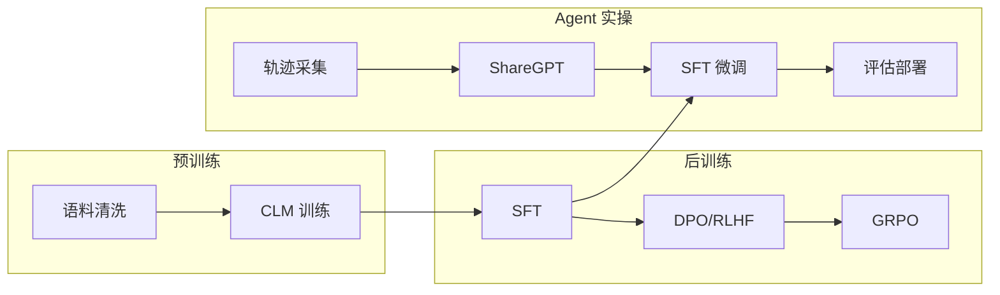

# 大模型训练知识库

系统学习 **预训练、后训练、分布式优化** 的完整知识库，同时包含 **Coding Agent SFT** 的实操指南。

## 知识全景

```
预训练 (Pretrain)          后训练 (Post-train)           工程 (Engineering)
├─ 数据工程                ├─ SFT 监督微调               ├─ 分布式并行
├─ Tokenizer               ├─ DPO / RLHF 对齐            ├─ 显存/通信优化
├─ CLM 目标                ├─ GRPO 推理增强              ├─ 评估 Benchmark
├─ Scaling Laws            ├─ 知识蒸馏                   └─ 推理部署
└─ Continued Pretrain      └─ Agent Tool Use
```

## 文档索引

### 系统学习（推荐从这里开始）

| 文档 | 内容 | 适合 |
|------|------|------|
| [00-学习路线.md](./00-学习路线.md) | 分阶段学习路径、自测标准、动手项目 | **入口** |
| [00-基础预备.md](./00-基础预备.md) | Transformer、PyTorch 分布式、HF 生态、训练基础 | **阶段 0** |
| [05-预训练基础.md](./05-预训练基础.md) | 数据工程、Tokenizer、CLM、Scaling Laws、CPT | 理解基座模型 |
| [06-后训练详解.md](./06-后训练详解.md) | SFT → DPO/RLHF → GRPO 全链路 | 理解对齐与增强 |
| [07-分布式训练与优化.md](./07-分布式训练与优化.md) | DDP/ZeRO/FSDP/TP/PP、混合精度、MFU | 多卡训练 |
| [08-核心概念与论文.md](./08-核心概念与论文.md) | 术语表、公式、论文索引、FAQ | 速查 |

### Coding Agent 实操

| 文档 | 内容 |
|------|------|
| [01-数据准备.md](./01-数据准备.md) | 轨迹采集、ShareGPT 格式、清洗规范 |
| [02-训练配置.md](./02-训练配置.md) | LLaMA-Factory / ms-swift 训练命令 |
| [03-评估与部署.md](./03-评估与部署.md) | Benchmark、vLLM 部署、A/B 测试 |
| [04-工具脚本.md](./04-工具脚本.md) | sh-mk 本地辅助工具 |

## 快速开始

### 路径 A：系统学习（零基础 → 能训练）

```
1. 读 00-学习路线.md，确定阶段
2. 00-基础预备.md → Transformer / HF / 训练基础
3. 05-预训练基础.md → 理解 CLM 和数据工程
3. 07-分布式训练与优化.md §1~3 → 理解为什么需要多卡
4. 06-后训练详解.md → 理解 SFT/DPO 区别
5. 动手：LLaMA-Factory LoRA SFT 一个 7B 模型
```

### 路径 B：Coding Agent SFT（已有基座，快速微调）

```
1. 01-数据准备.md → 准备 ShareGPT 数据
2. 02-训练配置.md → 启动 LoRA 训练
3. 03-评估与部署.md → Benchmark + vLLM 部署
```

### 路径 C：补分布式（已会 SFT，需要多卡 Full FT）

```
1. 07-分布式训练与优化.md → 选型 ZeRO/FSDP
2. 02-训练配置.md §DeepSpeed → 配置并启动
3. 08-核心概念与论文.md → MFU 计算与 profiling
```

## 整体流程



## 常见基座模型

| 模型 | 适用场景 | 推荐训练方式 |
|------|----------|-------------|
| Qwen2.5-Coder-32B | 通用代码生成 | Full / LoRA |
| Qwen2.5-Coder-7B | 轻量部署 | Full / LoRA |
| DeepSeek-Coder-V2 | 长上下文代码 | LoRA |
| Qwen3-Coder | 最新代码能力 | Full / LoRA |

## 训练框架对比

| 框架 | 特点 | 适用 |
|------|------|------|
| [LLaMA-Factory](https://github.com/hiyouga/LLaMA-Factory) | 配置简单、模板丰富 | 快速实验、SFT/DPO |
| [ms-swift](https://github.com/modelscope/ms-swift) | 多模态、大规模分布式 | 生产训练 |
| [DeepSpeed](https://www.deepspeed.ai/) | ZeRO 1/2/3 | 大模型 Full FT |
| [Megatron-LM](https://github.com/NVIDIA/Megatron-LM) | 3D 并行 | 100B+ Pretrain |
| [verl](https://github.com/volcengine/verl) | GRPO/RLHF | 推理模型 RL |
| [Unsloth](https://github.com/unslothai/unsloth) | 2x 加速、省显存 | 单卡 LoRA |

## 关键注意事项

1. **Pretrain 决定上限，Post-train 决定方向**：数据质量 > 数量
2. **SFT 保留完整工具调用链**：必须包含 `tool_calls` + `tool` 回复
3. **System Prompt 一致**：训练和推理必须相同
4. **长上下文**：Agent 轨迹通常 8K–32K tokens，注意 cutoff_len
5. **分布式选型**：LoRA 用 DDP，Full FT 32B+ 用 ZeRO-3
6. **Checkpoint 选择**：在 benchmark 上选最优，非最后一个

## sh-mk 工具

`sh-mk/` 目录提供轨迹采集、Replay 回放、Token 统计等本地工具，详见 [04-工具脚本.md](./04-工具脚本.md)。
